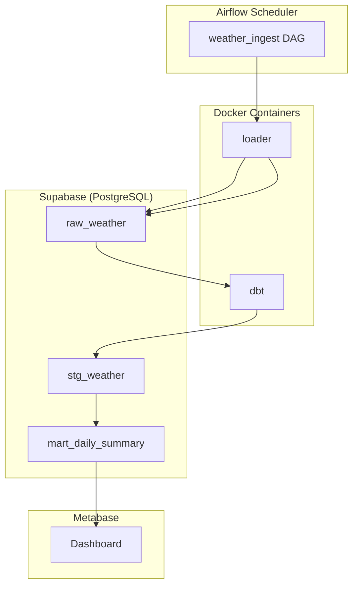

# Purpose
Define high‑level architectural principles, component interactions, and technology choices for the weather data ingestion, transformation, and analytics pipeline.

# When to Use
- Starting a new project or major redesign of the ETL stack.
- Evaluating trade‑offs between on‑premise vs cloud services.
- Aligning data platform decisions with business goals.
- Conducting architecture reviews before major releases.

# Responsibilities
- Create system context diagrams and data flow maps.
- Choose appropriate services (Supabase, Airflow, dbt, Docker, Metabase).
- Define integration contracts (APIs, database schemas, messaging).
- Establish non‑functional requirements (latency, availability, security).
- Provide guidance on CI/CD, monitoring, and observability.

# Workflow
1. **Stakeholder Interviews** – Gather requirements, SLAs, and growth expectations.
2. **Component Inventory** – List existing services (PostgreSQL, Airflow, Docker, Metabase) and gaps.
3. **Design Blueprint** – Draft architecture diagram (C4 model) with logical components and deployment topology.
4. **Technology Selection** – Evaluate alternatives (e.g., Snowflake vs Supabase) and justify choices.
5. **Define Interfaces** – Specify schema contracts, message formats, and versioning strategy.
6. **Document Decisions** – Record ADRs (Architecture Decision Records) in `docs/adr/`.
7. **Review & Iterate** – Conduct peer review, update diagrams, and get sign‑off.
8. **Implementation Guidance** – Provide concrete patterns for each component (refer to other Claude skills).

# Best Practices
- Adopt a modular, loosely‑coupled design; each service owns its data.
- Use feature flags to enable gradual roll‑outs.
- Prefer immutable infrastructure – treat Docker images as the unit of deployment.
- Enforce schema‑first development; migrations are source‑controlled.
- Centralise logging, metrics, and tracing (OpenTelemetry) across all services.

# Anti‑patterns
- Tight coupling between Airflow tasks and DB schema (hard‑coded table names).
- Monolithic ETL codebase that mixes extraction, transformation, and loading.
- Ignoring security – exposing Supabase keys in source control.
- Over‑optimising early; premature scaling decisions.
- Lack of versioning for data contracts leading to breaking downstream consumers.

# Checklist
- [ ] Architecture diagram (C4) created and stored in `docs/architecture/`.
- [ ] ADRs recorded for major decisions (DB choice, orchestration, container strategy).
- [ ] Non‑functional requirements defined and measurable.
- [ ] CI/CD pipeline includes build, test, scan, and deploy stages for all services.
- [ ] Observability stack (Prometheus + Grafana) integrated.
- [ ] Security review completed – secrets stored in Supabase/Vault, no plaintext in repo.

# Examples

# Project‑Specific Guidance
- Deploy Airflow on a managed Kubernetes service; expose it via an internal LoadBalancer.
- Use Supabase Edge Functions for lightweight validation before data reaches the DB.
- Store all infrastructure as code in `infra/` (Terraform modules for Supabase, Helm charts for Airflow).
- Ensure that Metabase connects to the Supabase replica, not the primary writer instance.
- Align release cycles: Docker images versioned with semantic tags, dbt runs triggered by Airflow DAG after successful load.
