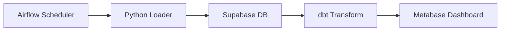

# Purpose
Provide a repeatable process and style guide for producing high‑quality technical documentation that supports developers, data analysts, and stakeholders.

# When to Use
- Writing or updating README, CONTRIBUTING, or architecture docs.
- Creating API reference for the Python ETL package.
- Documenting dbt models, Airflow DAGs, and Docker deployment steps.
- Preparing operational runbooks for monitoring and incident response.

# Responsibilities
- Produce Markdown documentation with consistent headings, tables, and code snippets.
- Generate diagrams (Mermaid, architecture images) and embed them.
- Maintain a docs folder structure (`docs/`, `docs/api/`, `docs/runbooks/`).
- Ensure all public-facing docs are version‑controlled and released with the code.
- Verify that docstrings are present for every public function/class.

# Workflow
1. **Scope Definition** – Identify the component (e.g., ETL loader, dbt model) and audience.
2. **Outline** – Create a skeleton with headings: Overview, Prerequisites, Usage, Parameters, Examples, FAQ.
3. **Write Content** – Fill in sections using plain language; embed code blocks and Mermaid diagrams.
4. **Review** – Run the `code-reviewer` skill checklist for documentation, ensure style compliance.
5. **Generate Assets** – Use `generate_image` tool for UI mock‑ups or architecture diagrams.
6. **Publish** – Commit to `docs/` and optionally generate a static site with MkDocs.
7. **Validate Links** – Run a link checker (`markdown-link-check`) to catch broken references.

# Best Practices
- Keep sentences short; use active voice.
- Use `> [!NOTE]` alerts to highlight important operational steps.
- Include a “Getting Started” quick‑start section with a runnable code snippet.
- Document environment variables and secret handling explicitly.
- Version docs with the same tag as the code release.

# Anti‑patterns
- Overly verbose explanations without concrete examples.
- Missing code snippets for CLI commands.
- Ignoring diagram updates after architectural changes.
- Storing large binary assets directly in the repo – use external storage or Git LFS.
- Using generic placeholders (`<YOUR_API_KEY>`) without clear substitution guidance.

# Checklist
- [ ] Document has a clear title and table of contents.
- [ ] All code blocks are syntax‑highlighted and runnable.
- [ ] Diagrams rendered correctly in Markdown preview.
- [ ] API references are generated via `pdoc` and included.
- [ ] Links to related docs (`../` paths) are valid.
- [ ] Review approved by a senior engineer.

# Examples
```markdown
## Installing the ETL package
```bash
pip install philweather-etl
```

## Loading data
```python
from philweather_etl.loader import load_weather
load_weather(date='2024-07-01')
```



# Project‑Specific Guidance
- All documentation lives under `docs/` at the repository root.
- Use the `mkdocs.yml` configuration provided in the repo to build the site (`mkdocs build`).
- Include a `CHANGELOG.md` entry for every new release, following the Keep a Changelog format.
- For runbooks, store templates in `docs/runbooks/` (e.g., `db_backup_runbook.md`).
- Reference Supabase Edge Functions documentation when describing validation steps.
