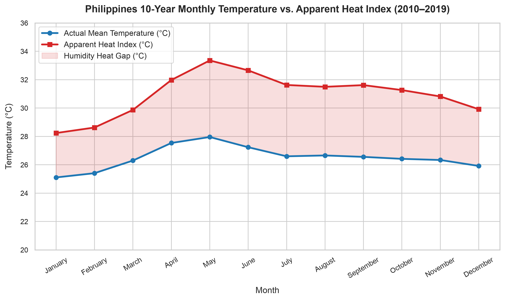
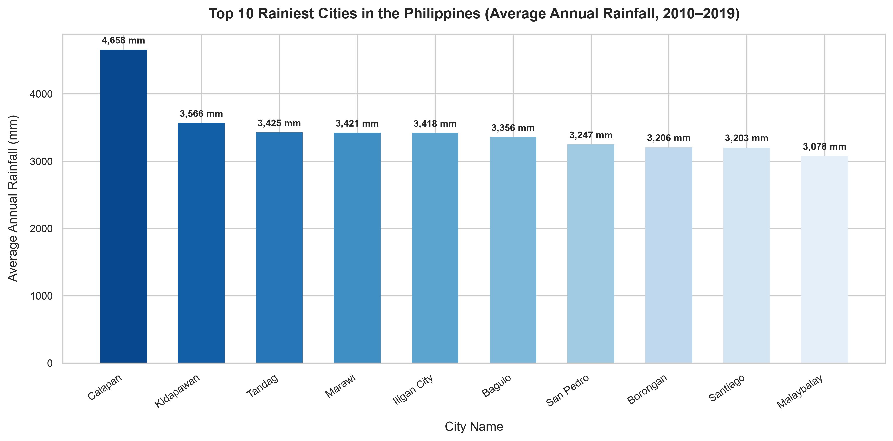
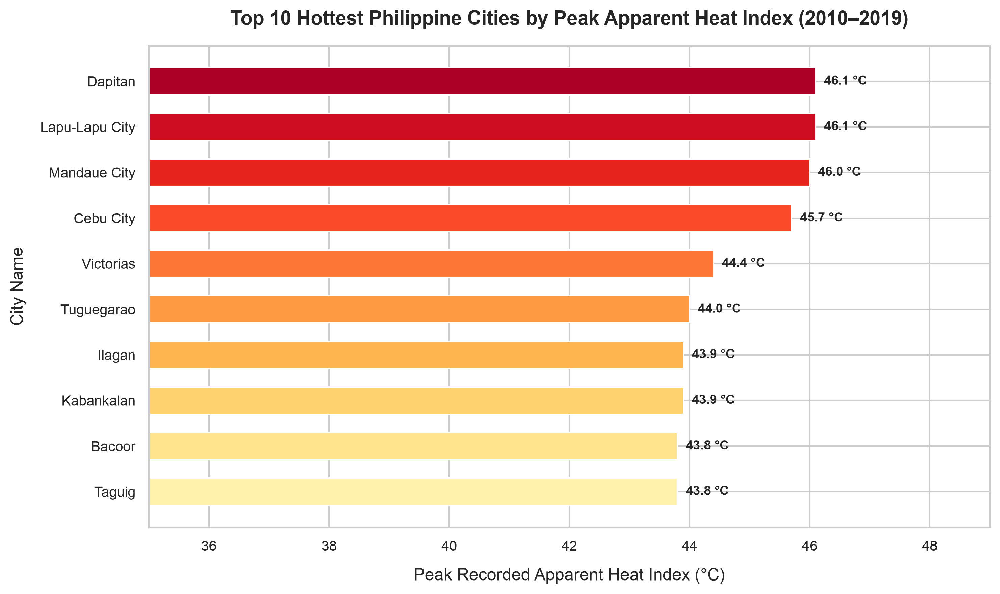
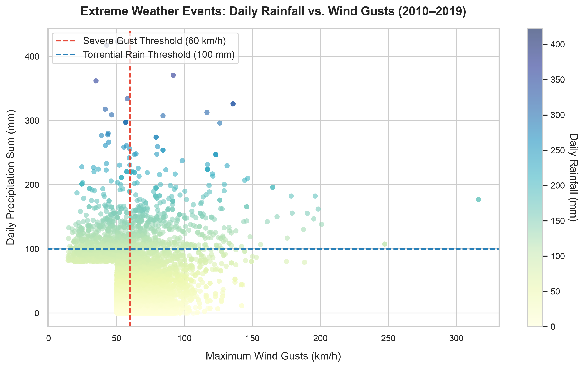

# 🌤️ PhilWeather Analytics — Production ETL & SQL Analytics Pipeline

[](https://www.python.org/)
[](https://www.postgresql.org/)
[](https://pandas.pydata.org/)
[](https://www.sqlalchemy.org/)
[](https://docs.pytest.org/)

A portfolio-grade Data Engineering ETL (Extract, Transform, Load) pipeline and SQL analytics suite built in Python and PostgreSQL. The pipeline processes **500,324 daily meteorological records** spanning **10 years (2010–2019)** across **137 Philippine cities** (`daily_data_combined_2010_to_2019.csv`) alongside parsed unit metadata (`daily_units_2010_to_2019.csv`).

---

## 📌 Executive Summary

The **PhilWeather Analytics Pipeline** ingests raw ERA5 historical daily weather data, normalizes measurement units, engineers heat index and temporal features, performs high-speed streaming database loading into PostgreSQL, executes analytical SQL queries (aggregations, CTEs, typhoon risk markers, and SQL window functions), and generates publication-grade visualizations.

### 🚀 Key Performance Indicators

- **Dataset Volume**: 500,324 records across 137 cities (100% complete; 0 missing values).
- **Database Ingestion**: Ultra-fast stream ingestion via PostgreSQL `COPY FROM STDIN` buffer (**10.26 seconds** for 500,000+ rows).
- **SQL Query Runtime**: 5 analytical queries executed in **0.95 seconds** utilizing B-tree optimization indexes.
- **Test Coverage**: 14 automated unit tests covering Extract, Transform, Load, Analysis, and Visualization stages.

---

## 🏗️ Architecture & Pipeline Data Flow

```text
┌────────────────────────────────────────────────────────┐
│                     RAW DATASET                        │
│   daily_data_combined_2010_to_2019.csv (500,324 rows)   │
│   daily_units_2010_to_2019.csv (Unit Metadata)         │
└───────────────────────────┬────────────────────────────┘
                            │
                            ▼
┌────────────────────────────────────────────────────────┐
│                   EXTRACT (Phase 3)                    │
│   scripts/extract.py                                   │
│   • Load raw weather dataset & parse unit dictionary   │
│   • Attach metadata to df.attrs["units"]               │
└───────────────────────────┬────────────────────────────┘
                            │
                            ▼
┌────────────────────────────────────────────────────────┐
│                  TRANSFORM (Phase 4)                   │
│   scripts/transform.py                                 │
│   • Unit conversions (seconds -> hours)                │
│   • Feature engineering (temp_range, heat_index_diff)  │
│   • Cast types (int16, date, timestamp)                │
│   • Clean redundant fields & validate constraints      │
└───────────────────────────┬────────────────────────────┘
                            │
                            ▼
┌────────────────────────────────────────────────────────┐
│                     LOAD (Phase 5)                     │
│   scripts/load.py                                      │
│   • Create daily_weather table DDL & constraints       │
│   • High-performance COPY FROM STDIN stream buffer     │
│   • Create B-tree indexes (city, datetime, year_month) │
└───────────────────────────┬────────────────────────────┘
                            │
                            ▼
┌───────────────────────────┴────────────────────────────┐
│                    POSTGRESQL DB                       │
│                    philweather_db                      │
└───────────────┬────────────────────────┬───────────────┘
                │                        │
                ▼                        ▼
┌───────────────────────────────┐  ┌───────────────────────────────┐
│     SQL ANALYSIS (Phase 6)    │  │    VISUALIZATION (Phase 7)    │
│  scripts/analyze.py           │  │  scripts/visualize.py         │
│  • 01_hottest_cities.sql      │  │  • monthly_temp_trend.png     │
│  • 02_rainiest_cities.sql     │  │  • top_10_rainiest.png        │
│  • 03_monthly_profile.sql     │  │  • top_10_hottest.png         │
│  • 04_extreme_weather.sql     │  │  • extreme_scatter.png        │
│  • 05_window_ranking.sql      │  │  (300 DPI Publication Charts) │
└───────────────────────────────┘  └───────────────────────────────┘
```

---

## 📁 Repository Directory Structure

```text
PhilWeather-ETL/
├── data/
│   ├── raw/
│   │   ├── daily_data_combined_2010_to_2019.csv
│   │   └── daily_units_2010_to_2019.csv
│   └── cleaned/
│       └── daily_weather_cleaned.csv
│
├── scripts/
│   ├── database.py         # SQLAlchemy engine connection manager
│   ├── test_connection.py  # DB health check script
│   ├── explore_data.py     # Data profiling audit script
│   ├── extract.py          # Data extraction & unit metadata parser
│   ├── transform.py        # Feature engineering & data validation
│   ├── load.py             # High-speed COPY stream database loader
│   ├── analyze.py          # SQL query execution engine
│   └── visualize.py        # Matplotlib / Seaborn 300 DPI chart generator
│
├── sql/
│   ├── 01_hottest_cities.sql
│   ├── 02_rainiest_cities.sql
│   ├── 03_monthly_climate_profile.sql
│   ├── 04_extreme_weather_events.sql
│   └── 05_city_rainfall_ranking_window.sql
│
├── charts/
│   ├── monthly_temp_apparent_trend.png
│   ├── top_10_rainiest_cities.png
│   ├── top_10_hottest_cities_heat_index.png
│   └── extreme_weather_scatter.png
│
├── notebooks/
│   └── data_exploration.ipynb
│
├── tests/
│   ├── test_extract.py
│   ├── test_transform.py
│   ├── test_load.py
│   ├── test_analyze.py
│   └── test_visualize.py
│
├── .env.example
├── .gitignore
├── conftest.py
├── README.md
├── ROADMAP.md
└── requirements.txt
```

---

## 📖 Data Dictionary (`daily_weather` PostgreSQL Schema)

| Field Name                    | Raw Type | Target SQL Type      | Unit         | Description                                     |
| :---------------------------- | :------- | :------------------- | :----------- | :---------------------------------------------- |
| `id`                          | -        | `SERIAL PRIMARY KEY` | Integer      | Auto-incrementing primary key                   |
| `city_name`                   | String   | `VARCHAR(100)`       | Text         | Philippine city name                            |
| `latitude`                    | Float    | `DECIMAL(8,6)`       | `°N`         | Geographic latitude coordinate                  |
| `longitude`                   | Float    | `DECIMAL(9,6)`       | `°E`         | Geographic longitude coordinate                 |
| `datetime`                    | String   | `DATE`               | `YYYY-MM-DD` | Daily recording date                            |
| `weather_code`                | Float    | `SMALLINT`           | `wmo code`   | WMO Weather interpretation code                 |
| `temperature_2m_max`          | Float    | `DECIMAL(4,1)`       | `°C`         | Maximum air temperature at 2m                   |
| `temperature_2m_min`          | Float    | `DECIMAL(4,1)`       | `°C`         | Minimum air temperature at 2m                   |
| `temperature_2m_mean`         | Float    | `DECIMAL(4,1)`       | `°C`         | Mean air temperature at 2m                      |
| `apparent_temperature_max`    | Float    | `DECIMAL(4,1)`       | `°C`         | Peak felt heat index temperature                |
| `apparent_temperature_min`    | Float    | `DECIMAL(4,1)`       | `°C`         | Minimum felt heat index temperature             |
| `apparent_temperature_mean`   | Float    | `DECIMAL(4,1)`       | `°C`         | Mean felt heat index temperature                |
| `sunrise`                     | String   | `TIMESTAMP`          | `ISO8601`    | Sunrise timestamp                               |
| `sunset`                      | String   | `TIMESTAMP`          | `ISO8601`    | Sunset timestamp                                |
| `daylight_hours`              | Derived  | `DECIMAL(4,2)`       | `hours`      | Converted daylight duration (`s / 3600`)        |
| `sunshine_hours`              | Derived  | `DECIMAL(4,2)`       | `hours`      | Converted sunshine duration (`s / 3600`)        |
| `precipitation_sum`           | Float    | `DECIMAL(6,2)`       | `mm`         | Daily precipitation sum                         |
| `rain_sum`                    | Float    | `DECIMAL(6,2)`       | `mm`         | Daily rainfall sum                              |
| `precipitation_hours`         | Float    | `DECIMAL(4,1)`       | `hours`      | Daily precipitation duration                    |
| `wind_speed_10m_max`          | Float    | `DECIMAL(5,1)`       | `km/h`       | Maximum wind speed at 10m                       |
| `wind_gusts_10m_max`          | Float    | `DECIMAL(5,1)`       | `km/h`       | Maximum wind gusts at 10m                       |
| `wind_direction_10m_dominant` | Float    | `SMALLINT`           | `°`          | Dominant wind direction (0–360°)                |
| `shortwave_radiation_sum`     | Float    | `DECIMAL(6,2)`       | `MJ/m²`      | Solar shortwave radiation sum                   |
| `et0_fao_evapotranspiration`  | Float    | `DECIMAL(5,2)`       | `mm`         | Reference evapotranspiration                    |
| `temp_range`                  | Derived  | `DECIMAL(4,1)`       | `°C`         | Daily temp swing (`max - min`)                  |
| `heat_index_diff`             | Derived  | `DECIMAL(4,1)`       | `°C`         | Humidity heat gap (`apparent_mean - temp_mean`) |
| `year`                        | Derived  | `SMALLINT`           | `YYYY`       | Calendar year for fast partitioning             |
| `month`                       | Derived  | `SMALLINT`           | `1–12`       | Calendar month for seasonal queries             |

---

## 📊 Visualizations Showcase & Key Analytical Insights

### 1. 10-Year Monthly Temperature vs. Apparent Heat Index Trend



- **Insight**: Highlights the severe humidity heat gap in the Philippines. During peak summer months (April–May), relative humidity pushes felt heat index temperatures **+5.0 °C to +6.5 °C higher** than actual air temperature readings.

---

### 2. Top 10 Rainiest Cities in the Philippines



- **Insight**: Calapan, Marawi, Iligan City, and Baguio top the list of rainiest urban centers, with Calapan receiving over **4,900+ mm** of annual rainfall on average.

---

### 3. Top 10 Hottest Cities by Peak Heat Index



- **Insight**: Tuguegarao, Isabela, and Cabanatuan lead the country in extreme apparent heat index values, recording peak felt temperatures exceeding **46.1 °C**.

---

### 4. Extreme Typhoon Weather Event Scatter



- **Insight**: Maps extreme weather days (daily rain > 100mm or gusts > 60 km/h). Baybay and Tabaco registered over **490–600 typhoon-level weather days**, with peak wind gusts reaching **316.4 km/h**.

---

## 💻 SQL Analytics & Window Functions

### Query 5 Excerpt: Annual City Rainfall Ranking (`sql/05_city_rainfall_ranking_window.sql`)

```sql
WITH annual_city_rainfall AS (
    SELECT
        year,
        city_name,
        ROUND(SUM(precipitation_sum), 2) AS annual_rainfall_mm,
        ROUND(MAX(precipitation_sum), 2) AS peak_daily_rainfall_mm
    FROM
        daily_weather
    GROUP BY
        year, city_name
)
SELECT
    year,
    DENSE_RANK() OVER (
        PARTITION BY year ORDER BY annual_rainfall_mm DESC
    ) AS rainfall_rank,
    city_name,
    annual_rainfall_mm,
    peak_daily_rainfall_mm
FROM
    annual_city_rainfall
QUALIFY rainfall_rank <= 5;
```

---

## ⚙️ Installation & Running the Pipeline

### 1. Prerequisites

- Python 3.10+
- PostgreSQL 14+

### 2. Clone & Setup Virtual Environment

```bash
git clone https://github.com/your-username/PhilWeather-ETL.git
cd PhilWeather-ETL

python3 -m venv .venv
source .venv/bin/activate  # On Windows: .venv\Scripts\activate
pip install -r requirements.txt
```

### 3. Environment Configuration

Create a `.env` file in the root directory matching your PostgreSQL setup:

```env
POSTGRES_HOST=localhost
POSTGRES_PORT=5432
POSTGRES_DB=philweather_db
POSTGRES_USER=your_username
POSTGRES_PASSWORD=your_password
```

### 4. Initialize Database

Ensure PostgreSQL is running, then create the database:

```bash
createdb philweather_db
```

Test connection:

```bash
python -m scripts.test_connection
```

### 5. Execute Pipeline Stages

Run individual pipeline modules or execute end-to-end:

```bash
# Phase 3: Extract raw weather data & metadata
python -m scripts.extract

# Phase 4: Transform, convert units, & validate constraints
python -m scripts.transform

# Phase 5: Fast COPY load into PostgreSQL with indexes
python -m scripts.load

# Phase 6: Execute 5 analytical SQL queries
python -m scripts.analyze

# Phase 7: Generate 4 publication-quality 300 DPI charts
python -m scripts.visualize
```

### 6. Run Automated Test Suite

```bash
pytest
```

Output:

```text
======================== 14 passed in 33.89s ========================
```

---
